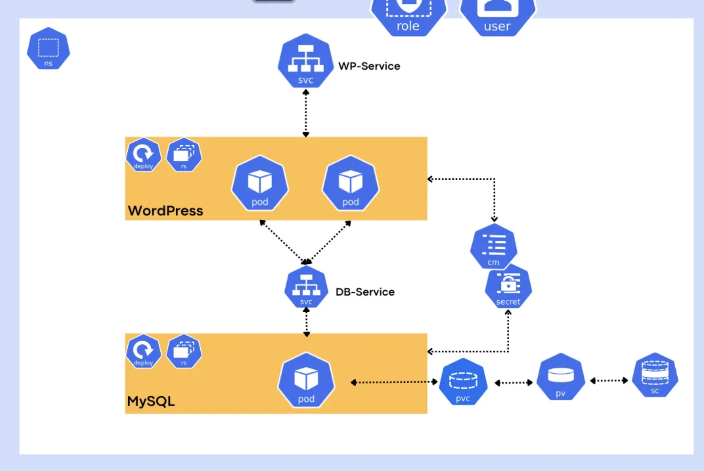

# containers-intro-2025-06-16

## Goal of the workshop

- Understand the basic concepts of containers and container orchestration.
- Understand the basic concepts of Kubernetes and OpenShift.
- Understand the differences between OpenShift, AKS, and Rancher.

## Goal with the containers, Kubernetes, and OpenShift

Why we want to use containers, Kubernetes, and OpenShift?

- Simplify application deployment and management.
- Enable developers to focus on writing code, not managing infrastructure.
- Provide a consistent environment for development, testing, and production.
- Improve scalability and resource utilization.
- Enable continuous integration and continuous deployment (CI/CD) practices.

## Current aplication management without containers

- Every team (or company) to do their own thing - no standardization
  - Every application is installed in a different way => hard to manage
- Applications are installed on virtual machines (manually, or using Ansible, ...)
  - => lots of manual work and space for human error
- Manual capacity planning - requires human intervention
- Lot's of VMs
  - no resource sharing, waste of resources
  - hard to manage

## What are containers?

> Containers are a lightweight, portable, and self-sufficient way to package and run applications. They allow developers to package an application with all its dependencies into a single unit that can run consistently across different environments.

## Containers vs Virtual Machines

## Benefits of containers

- Portability: Run the same container on any environment (local, staging, production).
- Isolation: Each container runs in its own environment, preventing conflicts between applications.
- Resource efficiency: Containers share the host OS kernel, reducing overhead compared to virtual machines.
- Scalability: Easily scale applications by adding or removing containers.
- Consistency: Ensures that applications run the same way in development, testing, and production environments.
- Faster deployment: Containers can be started and stopped quickly, enabling rapid development and testing cycles.

## What's inside a container?

All the dependencies needed to run an application are packaged together in a container image. This includes:

- Operating system libraries and dependencies
- Runtime (e.g., Python, Node.js, Java)
- Application code / binaries

## Distribution of containers

Containers are distributed as binary images, which are stored in container registries. These registries can be public (like Docker Hub) or private (like Red Hat's Quay).

Container image is a read-only template used to create containers. It includes everything needed to run an application, such as code, libraries, dependencies, and application runtime (all apart of configuration).

## Docker vs Podman vs other container runtimes

Containers are open standards, and there are several container runtimes available. The most popular ones include Docker and Podman. Each has its own features and use cases.

### Docker

Docker was the first widely adopted container runtime. It provides a complete platform for building, shipping, and running containers. Docker includes a command-line interface (CLI) and a graphical user interface (GUI) for managing containers.

=> More suitable for developers

### Podman (from RedHat)

Podman is a container runtime that is compatible with Docker but does not require a daemon to run. It allows users to manage containers without needing root privileges, making it more secure. Podman also supports running containers in rootless mode, which enhances security by isolating containers from the host system.

=> More suitable for production environments

## Demo

## What is Kubernetes?

Kubernetes is a portable, extensible, open-source platform for managing containerized workloads and services, that facilitates both declarative configuration and automation.

Source: https://kubernetes.io/docs/concepts/overview/what-is-kubernetes/

## Why Kubernetes?

- Unified platform for managing (containerized) applications
- Declarative configuration
- Automated deployment
- Scaling
- Load balancing
- Self-healing
- Rolling updates
- Service discovery
- Secret and configuration management
- Storage orchestration
- Batch execution
- Multi-cloud and hybrid cloud support
- Ecosystem and community support

## Kubernetes Architecture

## Application in Kubernetes

## Kubernetes Objects

## Pod

A Pod is the smallest deployable unit in Kubernetes. It represents a single instance of a running process in your cluster. A Pod can contain one or more containers that share the same network namespace and storage.

## Deployment

A Deployment is a higher-level abstraction that manages a set of Pods. It provides declarative updates to Pods and ReplicaSets, allowing you to define the desired state of your application and let Kubernetes handle the rest.

## StatefulSet

A StatefulSet is a Kubernetes object used to manage stateful applications. It provides guarantees about the ordering and uniqueness of Pods, making it suitable for applications that require stable network identities and persistent storage.

## Service

A Service is an abstraction that defines a logical set of Pods and a policy to access them. It provides a stable endpoint for accessing the Pods, allowing you to expose your application to the network.

## Ingress

An Ingress is a collection of rules that allow inbound connections to reach the cluster services. It provides HTTP and HTTPS routing to services based on the request host and path.

## ConfigMap

A ConfigMap is a Kubernetes object used to store non-confidential configuration data in key-value pairs. It allows you to decouple configuration from application code, making it easier to manage and update configurations without rebuilding the container image.

## Secret

A Secret is a Kubernetes object used to store sensitive information, such as passwords, tokens, or SSH keys. It provides a way to securely manage and access sensitive data within your applications.

## What is OpenShift?

OpenShift is a Kubernetes distribution from Red Hat. It provides additional features on top of Kubernetes, such as:

- Developer and operational tools
- Enhanced security
- Integrated CI/CD pipelines
- Developer-friendly user interface
- Built-in monitoring and logging

## Openshift vs Vanilla Kubernetes

- OpenShift is built on top of Kubernetes, so it inherits all the features of Kubernetes.
- OpenShift adds additional features and tools to make it easier to use for developers and operators.
- Easier installation and management.
- OpenShift provides a more user-friendly interface for managing applications.

## OpenShift vs AKS

- OpenShift is a self-managed platform, while AKS is a managed service provided by Microsoft Azure.
- OpenShift provides a more comprehensive set of features for developers and operators, while AKS is focused on providing a managed Kubernetes service.
- OpenShift is more suitable for organizations that want to have full control over their Kubernetes environment, while AKS is more suitable for organizations that want to use Kubernetes without managing the underlying infrastructure.
- No vendor lock-in with OpenShift, as it can be run on any infrastructure (on-premises, public cloud, private cloud), while AKS is tied to Microsoft Azure.

## OpenShift vs Rancher

- OpenShift is a complete Kubernetes distribution with additional features and tools, while Rancher is a management platform for Kubernetes clusters.
- OpenShift provides a more comprehensive set of features for developers and operators, while Rancher focuses on managing multiple Kubernetes clusters.
- OpenShift is more suitable for organizations that want a complete platform for managing containerized applications, while Rancher is more suitable for organizations that want to manage multiple Kubernetes clusters across different environments.

## CNCF Ecosystem

CNCF (Cloud Native Computing Foundation) is an organization that promotes the adoption of cloud-native technologies. It hosts many projects related to containers, Kubernetes, and cloud-native applications. Some of the key projects include:

- Kubernetes: The core container orchestration platform.
- Prometheus: A monitoring and alerting toolkit for cloud-native applications.
- ArgoCD: A declarative, GitOps continuous delivery tool for Kubernetes.
- Helm: A package manager for Kubernetes that simplifies the deployment of applications.

and many more.

## Demo

## Example Cluster

- Console: https://console-openshift-console.apps.dhl.germanywestcentral.aroapp.io/
- Username: `kubeadmin`
- Password: `SS5bx-jrpTi-QjjJD-yTeAQ`
